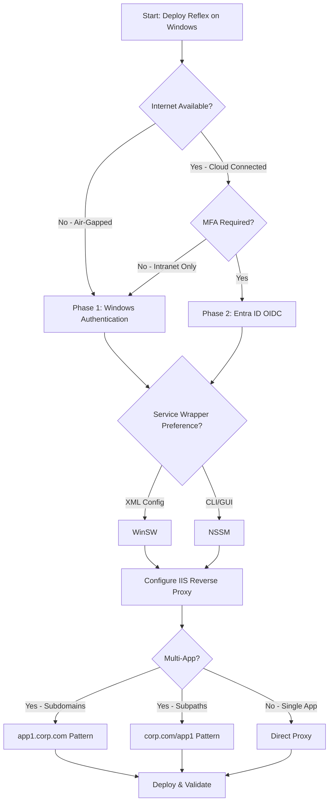
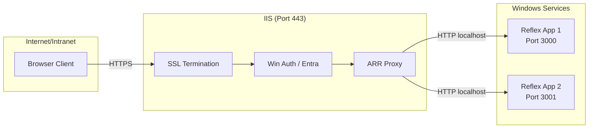

# Reflex Windows Deployment

**Bottom Line Up Front:** This production-ready skill enables developers to deploy Reflex (Python) full-stack applications on Windows Server 2016/2019/2022 using WinSW or NSSM service wrappers behind IIS reverse proxy with enterprise authentication. The two-phase authentication approach supports air-gapped intranets (Windows Auth/Kerberos) and cloud-connected environments (Microsoft Entra ID/OIDC) with validated templates and comprehensive troubleshooting guidance.

## Decision Tree: Choosing Your Deployment Path

## Quick Start Checklist

| Step | Action | Time |
|------|--------|------|
| 1 | Install Python 3.11+ and create venv | 5 min |
| 2 | Install Reflex: `pip install reflex` | 2 min |
| 3 | Build app: `reflex run --env prod` | 3 min |
| 4 | Install WinSW/NSSM service wrapper | 5 min |
| 5 | Configure IIS with ARR + URL Rewrite | 15 min |
| 6 | Enable Windows Auth OR configure Entra ID | 20 min |
| 7 | Validate with deployment checklist | 10 min |

## Architecture Pattern: Reverse Proxy with Service Wrapper

## Additional Resources

### Core Documentation
- **`docs/core/reflex-application-preparation.md`** - rxconfig.py and build commands
- **`docs/core/windows-service-management.md`** - WinSW and NSSM configuration
- **`docs/core/iis-reverse-proxy-setup.md`** - IIS, ARR, and URL Rewrite setup
- **`docs/core/windows-authentication-phase1.md`** - Windows Authentication (Phase 1)
- **`docs/core/ms-entra-authentication-phase2.md`** - Entra ID Authentication (Phase 2)
- **`docs/core/multi-app-deployment-strategy.md`** - Hosting multiple apps
- **`docs/core/air-gapped-deployment-guide.md`** - Offline deployment
- **`docs/core/deployment-checklist.md`** - Validation checklists

### Advanced Documentation
- **`docs/advanced/troubleshooting-guide.md`** - Solving common errors and Heuristic Matrix
- **`docs/advanced/security-hardening.md`** - Security best practices
- **`docs/advanced/maintenance-operations.md`** - Observability, PerfMon, and logging

### Templates
- **`templates/winsw/winsw.xml`** - WinSW configuration
- **`templates/nssm/install-service.ps1`** - NSSM installer script
- **`templates/iis/web.config.basic`** - Basic IIS web.config
- **`templates/iis/web.config.winauth`** - Windows Auth web.config
