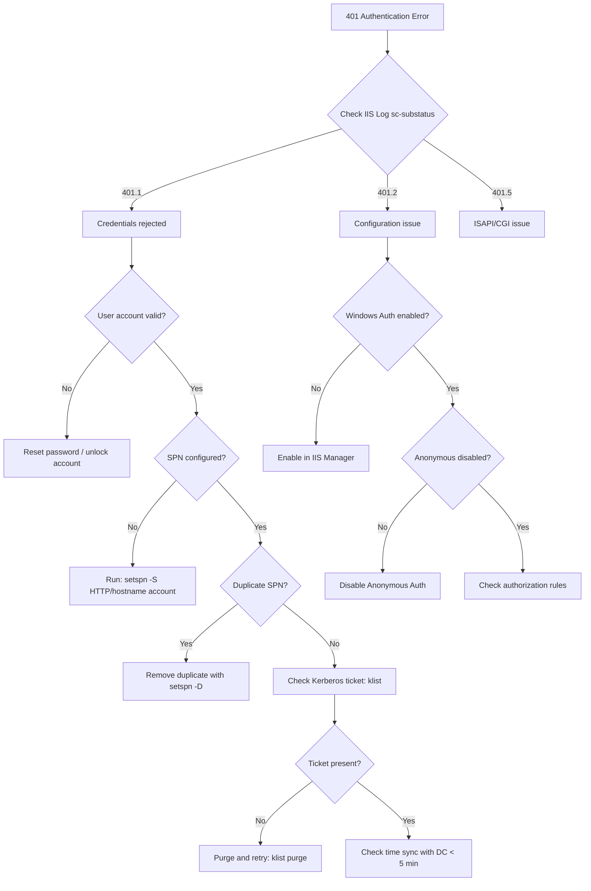

# Windows Authentication (Phase 1)

## IIS Windows Authentication Setup

```powershell
# Install Windows Authentication feature
Install-WindowsFeature Web-Windows-Auth

# Enable Windows Auth, disable Anonymous (via appcmd)
$siteName = "MyReflexApp"
C:\Windows\System32\inetsrv\appcmd.exe set config "$siteName" /section:anonymousAuthentication /enabled:false
C:\Windows\System32\inetsrv\appcmd.exe set config "$siteName" /section:windowsAuthentication /enabled:true
```

## web.config — Windows Authentication with Header Injection

```xml
<?xml version="1.0" encoding="UTF-8"?>
<!--
  IIS web.config for Reflex with Windows Authentication (Phase 1)
  Passes authenticated username to backend via X-Remote-User header
-->
<configuration>
  <system.webServer>
    <webSocket enabled="true" />
    
    <!-- Windows Authentication -->
    <security>
      <authentication>
        <anonymousAuthentication enabled="false" />
        <windowsAuthentication enabled="true" useKernelMode="true">
          <providers>
            <clear />
            <add value="Negotiate" />
            <add value="NTLM" />
          </providers>
        </windowsAuthentication>
      </authentication>
    </security>
    
    <rewrite>
      <!-- CRITICAL: Whitelist variables for distributed rules -->
      <allowedServerVariables>
        <add name="HTTP_X_REMOTE_USER" />
        <add name="HTTP_X_FORWARDED_FOR" />
        <add name="HTTP_X_FORWARDED_PROTO" />
      </allowedServerVariables>
      
      <rules>
        <!-- HTTPS Redirect -->
        <rule name="HTTPS Redirect" stopProcessing="true">
          <match url="(.*)" />
          <conditions>
            <add input="{HTTPS}" pattern="^OFF$" />
          </conditions>
          <action type="Redirect" url="https://{HTTP_HOST}/{R:1}" />
        </rule>
        
        <!-- Inject authenticated user into header -->
        <rule name="Reflex Proxy with Auth" stopProcessing="true">
          <match url="(.*)" />
          <conditions>
            <add input="{LOGON_USER}" pattern=".+" />
          </conditions>
          <serverVariables>
            <!-- DOMAIN\username or username@domain.com -->
            <set name="HTTP_X_REMOTE_USER" value="{LOGON_USER}" />
            <set name="HTTP_X_FORWARDED_PROTO" value="{REQUEST_SCHEME}" />
            <set name="HTTP_X_FORWARDED_FOR" value="{REMOTE_ADDR}" />
          </serverVariables>
          <action type="Rewrite" url="http://127.0.0.1:3000/{R:1}" />
        </rule>
      </rules>
    </rewrite>
    
    <httpErrors existingResponse="PassThrough" />
  </system.webServer>
</configuration>
```

## Python Middleware for Reading X-Remote-User

```python
# middleware/windows_auth.py
from starlette.middleware.base import BaseHTTPMiddleware
from starlette.requests import Request

class WindowsAuthMiddleware(BaseHTTPMiddleware):
    """
    Middleware to extract Windows-authenticated user from X-Remote-User header.
    Only trust this header when running behind IIS with Windows Auth enabled.
    """
    
    def __init__(self, app, trusted_proxies: list = None):
        super().__init__(app)
        self.trusted_proxies = trusted_proxies or ["127.0.0.1", "::1"]
    
    async def dispatch(self, request: Request, call_next):
        # Only trust header from known proxy IPs
        client_ip = request.client.host if request.client else None
        
        if client_ip in self.trusted_proxies:
            # Extract authenticated user
            remote_user = request.headers.get("X-Remote-User", "")
            
            if remote_user:
                # Parse DOMAIN\username format
                if "\\" in remote_user:
                    domain, username = remote_user.split("\\", 1)
                elif "@" in remote_user:
                    username, domain = remote_user.split("@", 1)
                else:
                    username = remote_user
                    domain = ""
                
                # Store in request state for access in route handlers
                request.state.auth_user = username
                request.state.auth_domain = domain
                request.state.auth_full = remote_user
        
        return await call_next(request)

# Usage in Reflex app
# In your main app file:
# app.add_middleware(WindowsAuthMiddleware, trusted_proxies=["127.0.0.1"])
```

## SPN Configuration for Kerberos

```powershell
# Register SPNs for the IIS service account
# Replace DOMAIN\svc_iis with your service account

# For hostname access
setspn -S HTTP/myapp DOMAIN\svc_iis
setspn -S HTTP/myapp.corp.com DOMAIN\svc_iis

# Verify SPNs
setspn -L DOMAIN\svc_iis

# Check for duplicates (CRITICAL - duplicates break Kerberos)
setspn -X
```

## Troubleshooting 401 Loops Decision Tree


